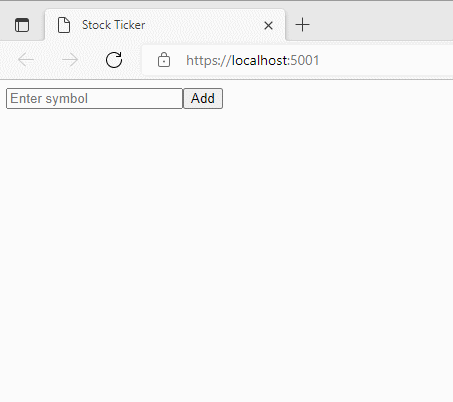

When .NET 6 came out late last year, I was quite amazed by how lightweight you can now write an ASP.NET web service. Much of the boilerplate code that you'd normally find in previous iterations of .NET can be replaced with this succinct, easy-to-understand configuration that fits comfortably in a single file.
As one who loves to seek ways to write less code when it can do the same thing and as long as that it doesn't affect readability, this resonates with me.

I was inspired to do something similar with real-time updates.<br/> SignalR is already doing a great job in hiding all that complexity of implementing real-time bi-directional communication on the web. DotNetify builds on top of it by introducing a state management abstraction between the server and its connected clients that integrates with a variety of front-end frameworks, and in doing so, reduces a lot of plumbing code.

However, when it comes to web applications leveraging real-time technology, I suspect that for many applications, the use case is fairly simple: _unidirectional data flow from an event source to the browser_. There won't be any need for server-side state management or for complex orchestration. Something like minimal APIs but for real-time updates would be appealing.

And so, without further ado, here's what it looks like in its most basic form (requires dependency on [`DotNetify.SignalR`](https://www.nuget.org/packages/DotNetify.SignalR/5.3.0) package):

**Program.cs:**

```csharp
using DotNetify;
using System.Reactive.Linq;

var builder = WebApplication.CreateBuilder(args);

builder.Services.AddDotNetify().AddSignalR();

var app = builder.Build();

app.MapHub<DotNetifyHub>("/dotnetify");

app.MapVM("HelloWorld", () => new {
   Greetings = "Hello World",
   ServerTime = Observable
      .Interval(TimeSpan.FromSeconds(1)).Select(_ => DateTime.Now)
});

app.Run();
```

The new API here is **`MapVM`**, where _VM_ stands for _view model_. The first parameter is the view model's name for the client-side script to identify which instance to connect with. The second parameter is an anonymous method that returns an anonymous object representing the view model's state to be pushed to the client.

The object's property values will be serialized and included in the response when the client initially connects. The interesting part here is when the property value implements `System.IObservable<T>`. The internal logic will **establish a subscription and automatically push every new value to the client** for as long as it remains connected.

This API will be of little use if it cannot access the dependency injection container. And so the logic also handles service injection and supports async operations:

```csharp
app.MapVM("HelloWorld", async (IDateTimeService service) => new {
   ServerTime = await service.GetDateTimeObservableAsync()
});
```

What if you want the client to be able to send commands back to the server? That's also supported. Set the property value to an action method with zero or one argument, then you can use the property name for the `vm.$dispatch` call on the client to invoke the action:

```csharp
app.MapVM("HelloWorld", async (IDateTimeService service) => new {
   ServerTime = await service.GetDateTimeObservableAsync(),
   SetTimeZone = new Action<string>(zone => service.SetTimeZone(zone));
});

```

And lastly, this API can be protected with [dotNetify's [Authorize] attribute](https://dotnetify.net/core/api/security) from unauthenticated requests:

```csharp
app.MapVM("HelloWorld", [Authorize] () => new { /*...*/ });

```

### Example: A Minimal Real-Time Web Component

Now that a web service that serves real-time updates can be made astonishingly light, let's shift our attention to the front-end.

Let's say our goal is to create a UI component to display those updates and that it can be easily embedded to existing websites, no matter which UI framework they're using. And in the spirit of doing it as minimal as we can, we would like it also that it won't involve building with Node.js.

The most portable way to share UI components is by making them native HTML custom elements. It usually involves quite a few steps to make one, but luckily, beginning with version 3.2, [Vue](https://v3.vuejs.org/guide/web-components.html) provides a built-in API to convert a Vue component into one. Vue is a great UI framework to work with, and if we just keep it to modern browsers, it's very possible to write code using the latest Javascript syntax and run without needing to transpile.

I came up with an example that simulates a rudimentary stock ticker app. It has an input field for stock symbol lookup, and an area to display the symbols with their current prices which updates every second. Here's what it looks like:



I only need two front-end files to add to the service:

**1. index.html:**

```html
<!DOCTYPE html>
<html lang="en">
  <head>
    <meta charset="utf-8" />
    <meta name="viewport" content="width=device-width, initial-scale=1" />
    <title>Stock Ticker</title>
  </head>
  <body>
    <stock-ticker />

    <script src="https://cdn.jsdelivr.net/npm/@microsoft/signalr@5/dist/browser/signalr.min.js"></script>
    <script src="https://unpkg.com/vue@3/dist/vue.global.prod.js"></script>
    <script src="https://unpkg.com/dotnetify@latest/dist/dotnetify-vue.min.js"></script>

    <script src="/stock-ticker.js"></script>
  </body>
</html>
```

**2. stocker-ticker.js**:

```js
const StockTicker = Vue.defineCustomElement({
  template: `
    <form onsubmit="return false">
      <div>
        <input type="text" placeholder="Enter symbol" v-model="symbol"/>
        <button type="submit" @click="add">Add</button>
      </div>
    </form>
    <div v-for="(price, symbol) in StockPrices" :key="symbol">
      <h5>{{ symbol }}</h5>
      <h1>{{ price }}</h1>
    </div>
`,
  created() {
    this.vm = dotnetify.vue.connect("StockTicker", this)
  },
  unmounted() {
    this.vm.$destroy()
  },
  data() {
    return { symbol: "", StockPrices: [] }
  },
  methods: {
    add() {
      this.vm.$dispatch({ AddSymbol: this.symbol })
      this.symbol = ""
    },
  },
})

customElements.define("stock-ticker", StockTicker)
```

And the rest of the files in this example web service:

**3. StockTicker.csproj**:

```xml
<Project Sdk="Microsoft.NET.Sdk.Web">

  <PropertyGroup>
    <TargetFramework>net6.0</TargetFramework>
    <ImplicitUsings>enable</ImplicitUsings>
  </PropertyGroup>

  <ItemGroup>
    <PackageReference Include="DotNetify.SignalR" Version="5.3.0" />
  </ItemGroup>

</Project>

```

**4. Program.cs:**

```cs
using DotNetify;
using StockTicker;

var builder = WebApplication.CreateBuilder(args);
builder.Services.AddDotNetify().AddSignalR();
builder.Services.AddScoped<IStockTickerService, StockTickerService>();

var app = builder.Build();
app.MapHub<DotNetifyHub>("/dotnetify");
app.MapVM("StockTicker", (IStockTickerService service) => new
{
   service.StockPrices,
   AddSymbol = new Action<string>(symbol => service.AddSymbol(symbol))
});
app.UseStaticFiles();
app.MapFallbackToFile("index.html");

app.Run();
```

**5. StockTickerService.cs**:

```cs
using System.Reactive.Subjects;
using System.Reactive.Linq;
using StockPriceDict =
  System.Collections.Generic.Dictionary<string, double>;

namespace StockTicker;

public interface IStockTickerService
{
   IObservable<StockPriceDict> StockPrices { get; }
   void AddSymbol(string symbol);
}

public class StockTickerService : IStockTickerService
{
   private readonly Subject<StockPriceDict> _stockPrices = new();
   private readonly List<string> _symbols = new();
   private readonly Random _random = new();

   public IObservable<StockPriceDict> StockPrices => _stockPrices;

   public StockTickerService()
   {
      Observable.Interval(TimeSpan.FromSeconds(1))
         .Select(_ => _symbols
            .Select(x => KeyValuePair
              .Create(x, Math.Round(1000 * _random.NextDouble(), 2)))
            .ToDictionary(x => x.Key, y => y.Value))
         .Subscribe(_stockPrices);
   }

   public void AddSymbol(string symbol)
   {
      if (!_symbols.Contains(symbol))
         _symbols.Add(symbol);
   }
}
```

You can download the example from [this repo](https://github.com/dsuryd/dotNetify/tree/master/Demo/Vue/MinimalAPI).

I don't know about you, but it feels really good to get this up and running with just a few small files and none of that ginormous `node_modules`!
