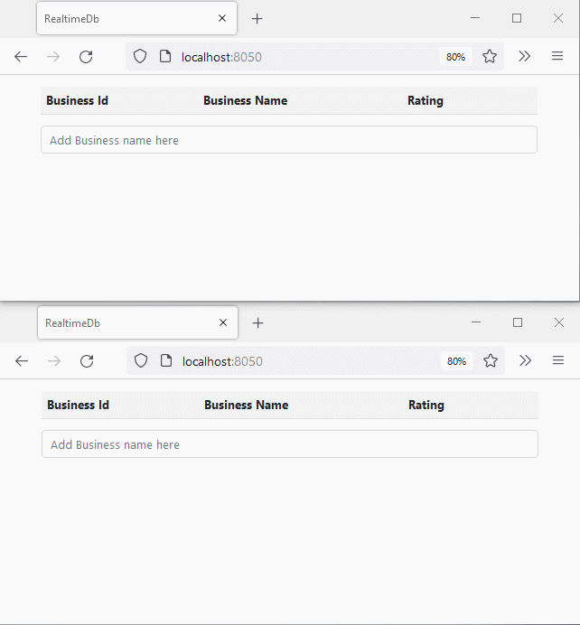

I was reading up on PostgreSQL when I noticed an interesting feature called logical replication. The documentation explains that logical replication is:

> "a method of replicating data objects and their changes, based upon their replication identity (usually a primary key)".

In other words, it's a way of ensuring copies of the database are always in sync by having the database publish logical data changes in real-time to subscriber nodes.

A replication subscriber would typically be another database that is serving as a copy of the master, but it's not limited to it and could be anything. What if we make that to be a web service? The service can then push those changes to multiple clients of a web application so they can always have their data synchronized in real-time.

There's actually another PostgreSQL feature, the NOTIFY command, that is intended to generate notifications, but we will need to write database triggers for each table we're interested in, and the string payload size has a limit of 8000 bytes. Logical replication has no such limit and can listen to all tables in the database, which makes it more scalable.

So I wrote a small open-source library that combines [dotNetify](https://dotnetify.net) with PostgreSQL logical replication. You can use it to build a web application with ASP.NET 5 that can react to all the inserts, updates, and deletes that any user of the app commits to a PostgreSQL database.

With this library that I named **DotNetify.Postgres** ([source code](https://github.com/dsuryd/dotNetify/tree/master/DotNetifyLib.Postgres)), your project won't involve polling the database, setting up a complicated pub/sub system, or take much code at all. The rest of the blog will take you through building a demo app.

## PostgreSQL Setup

To enable logical replication in your PostgreSQL database, find the _postgresql.conf_ configuration file, change the parameter `wal_level` to _logical_, and both `max_wal_senders` and `max_replication_slots` to at least 1. Changes will take effect after the service restarts.

You can also change them with SQL commands:

```sql
ALTER SYSTEM SET wal_level='logical';
ALTER SYSTEM SET max_wal_senders='10';
ALTER SYSTEM SET max_replication_slots='10';
```

The next step is to create a publication:

```sql
CREATE PUBLICATION my_pub FOR ALL TABLES;
```

We set it to publish data changes for all tables, but you can restrict it to just a specific table if you want.

When PostgreSQL is publishing replication records (also known as _write-ahead logs_ or WAL), it uses something called replication slots to ensure that the records do not get deleted until they're received by the subscribers.

Replication slots are great because they allow a subscriber to go temporarily offline and, on reconnect, to simply pick up where it left off. But there's a caveat: the WAL records can pile up in a prolonged disconnection event, to the point that it can run out of space and crash the database, and therefore, the slots need to be monitored.

Here's how we create a replication slot:

```sql
SELECT * FROM pg_create_logical_replication_slot('my_slot', 'pgoutput');
```

The _pgoutput_ is PostgreSQL's standard logical decoding plugin for transforming the changes from WAL to the logical replication protocol.

For the demo, let's create a simple table. We will also create a new user that will be used by our web service to connect to the database:

```sql
CREATE TABLE IF NOT EXISTS businesses (
  business_id serial PRIMARY KEY,
  business_name VARCHAR ( 50 ) UNIQUE NOT NULL,
  rating integer
);

CREATE USER my_user WITH PASSWORD 'my_pwd';
ALTER ROLE my_user WITH REPLICATION;
GRANT ALL PRIVILEGES ON ALL TABLES IN SCHEMA public TO my_user;
GRANT USAGE, SELECT ON ALL SEQUENCES IN SCHEMA public TO my_user;
```

Notice that we give the REPLICATION role to the user. Having this role is required for subscribing to replication slots.

The Postgres database is now configured for logical replication. The next step is to create a web service to subscribe to the replication slot we've created and push the changes to the website.

## Web Service Setup

You can download the source code from [this Github repo](https://github.com/dsuryd/dotNetify/tree/master/Demo/React/RealtimeDb.Postgres). This is an ASP.NET project with a React/Typescript front-end and Webpack. After installing the npm packages, you can run the project from either Visual Studio or dotnet CLI.

The code has an entity class for the demo table:

```csharp
[Table("businesses")]
public class Business
{
  [Column("business_id")]
  [Key]
  public long Id { get; set; }

  [Column("business_name")]
  public string Name { get; set; }

  [Column("rating")]
  public int Rating { get; set; }
}
```

There's a simple React client to display the content of the table, and the associated _dotNetify_ view model. The view model subscribes to the PostgreSQL data change events on the table through an API that the **DotNetify.Postgres** library provides, and pushes state updates to the client in real-time:

```csharp
  public class BusinessesVM : BaseVM
  {
    private IDisposable _subs;

    // Real-time list; see: https://dotnetify.net/core/api/crud.
    [ItemKey(nameof(Business.Id))]
    public List<Business> Businesses { get; set; }

    public BusinessesVM(IDbChangeObserver dbChangeObserver)
    {
        Businesses = new List<Business>();

        _subs = dbChangeObserver
          .Observe<Business>()
          .Subscribe(e =>
          {
              if (e is DbInsertEvent<Business>)
              {
                var row = (e as DbInsertEvent<Business>).Row;
                this.AddList(nameof(Businesses), row);
              }
              else if (e is DbUpdateEvent<Business>)
              {
                var row = (e as DbUpdateEvent<Business>).NewRow;
                this.UpdateList(nameof(Businesses), row);
              }
              else if (e is DbDeleteEvent<Business>)
              {
                var key = (e as DbDeleteEvent<Business>).Row.Id;
                this.RemoveList(nameof(Businesses), key);
              }
              PushUpdates();
        });
    }

    public override void Dispose() => _subs.Dispose();
  }
```

The connection string to our PostgreSQL database along with the publication and replication slot names are configured in the service startup class:

```csharp
public void ConfigureServices(IServiceCollection services)
{
    services.AddSignalR();
    services.AddDotNetify();
    services.AddDotNetifyPostgres(new PostgresConfiguration
    {
      ConnectionString = Configuration.GetConnectionString("Postgres"),
      PublicationName = "my_pub",
      ReplicationSlotName = "my_slot"
    });
}
```

And that's all there is to it! Here's how the app's reacting to data changes:


## Full CRUD with EF Core

So far we have a web page that's only reacting to data changes on the database. Let's take it a step further and make it capable of CRUD operations as well. For this, we're going to use EF Core with the [Npgsql](https://www.npgsql.org/) library.

Let's add a `DbContext` class for our demo table:

```csharp
public class BusinessDbContext : DbContext
{
  public DbSet<Business> Businesses { get; set; }
  public BusinessDbContext(DbContextOptions<BusinessDbContext> options)
    : base(options) {}
}
```

DotNetify view models must use a factory to create a new `DbContext` because of the long lifetimes. So we configure the `DbContextFactory` service in the startup class:

```csharp
public void ConfigureServices(IServiceCollection services)
{
  ...
  services.AddDbContextFactory<BusinessDbContext>(options =>
    options.UseNpgsql(Configuration.GetConnectionString("Postgres")));
}
```

The last step is implementing CRUD methods on the view model:

```csharp
public class BusinessesVM : BaseVM
{
  private readonly IDbContextFactory<BusinessDbContext> _contextFactory;

  [ItemKey(nameof(Business.Id))]
  public List<Business> Businesses { get; set; }

  public BusinessesVM(
    IDbContextFactory<BusinessDbContext> dbContextFactory,
    IDbChangeObserver dbChangeObserver)
  {
      _contextFactory = dbContextFactory;

      using var dbContext = _contextFactory.CreateDbContext();
      Businesses = dbContext.Businesses.OrderBy(x => x.Id).ToList();

      this.ObserveList<Business>(nameof(Businesses), dbChangeObserver);
  }

  public void Add(Business businessInfo)
  {
      using var dbContext = _contextFactory.CreateDbContext();
      dbContext.Businesses.Add(businessInfo);
      dbContext.SaveChanges();
  }

  public void Update(Business businessInfo)
  {
      using var dbContext = _contextFactory.CreateDbContext();
      var business = dbContext.Businesses.Find(businessInfo.Id);
      if (business != null)
      {
        business.Name = businessInfo.Name;
        business.Rating = businessInfo.Rating;
        dbContext.SaveChanges();
      }
  }

  public void Remove(Business businessInfo)
  {
      using var dbContext = _contextFactory.CreateDbContext();
      var business = dbContext.Businesses.Find(businessInfo.Id);
      if (business != null)
      {
        dbContext.Businesses.Remove(business);
        dbContext.SaveChanges();
      }
  }
}
```

As you may notice, the previous code that does the subscription and data change event handling are simplified into a single call to the _ObserveList_ extension method.

Here's an excerpt of the React client that invokes those CRUD methods:

```jsx
export const Businesses = () => {
  const { vm, state } = useConnect<State>("BusinessesVM");
  const [newName, setNewName] = useState<string>("");

  const addBusiness = (name: string) => {
    vm.$dispatch({ Add: new Business(0, name) });
    setNewName("");
  };

  const updateBusiness = (id: number, name: string, rating: number) => {
    vm.$dispatch({ Update: new Business(id, name, rating) });
  };

  const removeBusiness = (id: number) => {
    vm.$dispatch({ Remove: new Business(id) });
  };
...
```

And with that, here's the demo of two browser instances of the app keeping in sync with each other while we apply some CRUD operations:



##

I hope this is useful to you! I'd be interested to hear what you think. Reply to [my tweet](https://twitter.com/dotnetify/status/1422453418581389315) and let me know. And feel free to retweet!
