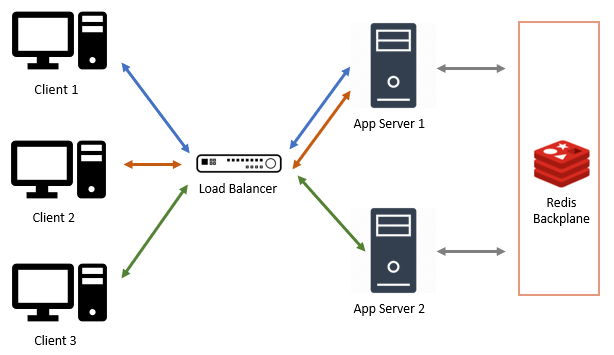

Just a few weeks ago [dotNetify](https://dotnetify.net) passed the 100k NuGet downloads. I'm thrilled that so many people have found this project compelling enough to try out, and based on the feedback I've been getting, it's being used in production as well!

For those who are unfamiliar with dotNetify, it's an Apache2-licensed FOSS that does the following in a nutshell:

> dotNetify provides a layer of MVVM-styled abstraction over SignalR to facilitate real-time communication between the web front-end of your application and its ASP.NET Core back-end.

It offers built-in integration with some client-side frameworks, such as **React**, **Vue**, and **Blazor**, resulting in code that's declarative, concise, and easy to read. For example, here's what it would look like to implement a rudimentary stock ticker UI using Vue:


Doesn't it look clean? You only write views and its view models, and automatically get access to the bidirectional, real-time functionality provided by SignalR without having to write the low-level code yourself.

## SignalR Scale-Out Options

Running a dotNetify app on a single server is pretty straightforward, but on a few occasions, questions were asked about its scalability in a multi-server architecture. Scaling SignalR-based apps horizontally is tricky compared to REST APIs. There are at least two main issues to contend with:

1. Since SignalR connection is stateful, when a client sends a request to a server, subsequent requests must go to the same server.

2. Every server is only aware of its own client connections. If the app needs to broadcast to all clients, the payload must first be delivered to all servers so they can broadcast it to their respective clients.

The first issue can be solved by either configuring the load balancer so it always redirect the requests from a particular client to the same server (so-called "sticky sessions"), or making SignalR skips its transport negotiation and go straight to the persistent WebSocket connection. Still, either way gives rise to a harder problem: sticky connections stick to one server, and if that server is at capacity, how can we redistribute the load to a new server? But this is a discussion for another day.

The second issue is commonly addressed by having an intermediary server with a pub/sub channel to which every app server subscribes. Incoming client messages to one server are published to the channel so the other servers may get them too. The SignalR documentation refers to this as a "backplane" and recommends using Redis due to its fast in-memory store.



In 2018, Microsoft started to offer its cloud solution in place of Redis — the Azure SignalR Service. What's interesting is that it doesn't use a pub/sub broker, but what looks to be a cluster of reverse proxies. Instead of duplicating the app servers, it puts this cluster of proxy servers in front of the app server and maintains a fixed number of persistent connections between them. Any client that attempts to establish a connection to the app server will be redirected to connect with a proxy. And for the duration of the connection, the proxy will forward the messages between the client and the app server.


The messages are multiplexed through that constant number of connections, which means that the app server won't be sensitive to how many active client connections there are, only the message throughput.

Between the two scale-out options, the proxy method seems to be the better option because:

1. The app server won't need to scale just to handle a large number of concurrent connections, especially when they're mostly idle.

2. The app server won't waste its resources maintaining connections.

3. The app server can be made aware of all the connections and can use connection ids to keep track of clients.

4. You won't have to deal with the hassle of managing (or paying for) Redis.

The obvious downside is that if you can't/won't run on Azure, then you don't get that option! Even without the cost consideration, many still face restrictions on which cloud provider they can use, if at all.
In the following section, I describe my effort to make it so that dotNetify apps can use the proxy scale-out option either on-prem or on non-Azure cloud providers.

## Forwarding Middleware

The Azure SignalR Service is not open source, so I could only guess how the proxying is actually done, but it can be surmised that the ability to forward messages from one SignalR hub server to another is the key piece. The thought of using the dotNetify middleware mechanism immediately jumped out to me.

DotNetify middlewares are similar to ASP.NET middlewares in concept, but instead of HTTP requests, they intercept SignalR messages. They are intended to process payload metadata, such as JWT access tokens and custom initialization arguments, and can be chained to form a pipeline.

The idea I ran with was to introduce a middleware that makes a fixed number of SignalR connections to an app server and passes all client messages through these connections. They're also bi-directional — passing messages from the app server to the intended clients. In essence, its purpose is to facilitate logical connections between the app server and the clients.

Implementing scale-out then becomes a matter of enabling this middleware on some plain, inexpensive proxy servers:


A proxy server is simply a bare-bone ASP.NET Core web app with the following code in `Startup.cs`:

```csharp
using DotNetify;
using DotNetify.Forwarding;
...
namespace ProxyServer
{
   public class Startup
   {
      public void ConfigureServices(IServiceCollection services)
      {
         services.AddSignalR();
         services.AddDotNetify();
      }

      public void Configure(IApplicationBuilder app)
      {
         app.UseWebSockets();
         app.UseDotNetify(config =>
         {
            config.UseForwarding("<app_server_url>");
         });
         app.UseRouting();
         app.UseEndpoints(ep => ep.MapHub<DotNetifyHub>("/dotnetify"));
      }
   }
}
```

An important consideration was to make sure that the view models or other middlewares won't be aware of the proxies. A multicast view model that uses connection ids to track clients should not be implemented any different when it's operating behind proxies than when it's not. This was solved by having the receiver end on the app server create a logical connection context that exposes the original connection id.

## Forwarding Options

The forwarding middleware provides the following options:

```csharp
public class ForwardingOptions
{
  public int ConnectionPoolSize { get; set; } = 5;
  public Func<DotNetifyHubContext, bool> Filter { get; set; }
  public bool UseMessagePack { get; set; } = false;
  public bool HaltPipeline { get; set; } = true;
}
```

**ConnectionPoolSize:** the number of SignalR connections the proxy server will establish with the app server. Messages to be delivered will take turns using a connection from the pool in a round-robin fashion. Naturally, the pool size should be increased if the anticipated throughput is high.

**Filter:** optional predicate for whether or not to forward a message. Chaining multiple forwarding middlewares with filters allow for all kinds of interesting configuration, such as having specialized app servers handling different user groups or certain types of view models.

**UseMessagePack:** use MessagePack serialization format to keep the payload small.

**HaltPipeline:** stop processing beyond the middleware. This flag allows the middleware to be used not just for scale-out, but for observability, i.e. sending messages to a real-time monitoring server.

## Devising Load Tests

Needless to say, substantial code refactoring had to be done to dotNetify for this, and I needed to build confidence that the whole thing would actually work! First, I would need a load testing tool to emulate a high number of concurrent client connections. There's a Microsoft benchmark tool called [Crankier](https://github.com/dotnet/aspnetcore/tree/main/src/SignalR/perf/benchmarkapps/Crankier), but it only tries to hold open connections and not measuring anything related to the message payload.

In the end, I built my own tool that can be customized for any kind of workload, and wrote some test profiles according to what I thought were the most common ones:

- **Broadcast:** The server pushes updates to all clients at regular intervals. A single multicast view model instance is used.

- **Echo:** Continuous back and forth communication between the client and the server. The server sends a message to the client and waits for the response before sending the next one.

- **Chat Room:** This profile models chat rooms where clients are sending and receiving messages with each other and within groups. The clients within a group are configured into 3 types:

<div style="margin-left: 30px">

- Chatty posters (10%): send a message every 11 seconds.
- Casual posters (20%): send a message every 59 seconds.
- Lurkers (70%): only receive messages.

</div>

The message payload contains a sequence number and a timestamp to allow the test to detect undelivered messages and measure the average round-trip latency. [The source code is available here](https://github.com/dsuryd/dotNetify-LoadTester.Profiles).

Next, I created an app server with the test view models and deployed it along with 2 proxy servers to a free-tier Heroku container environment. According to the specs, each server node only has 500MB memory and 1x CPU share, so I would have to balance the number of connections with the throughput so as not to overwhelm the resources.

I ran my tool from my own machine to emulate client connections. I set the connections to 1000 (following the limit on an Azure SignalR standard unit) with a new connection every 100 ms, running a broadcast test with 3 seconds interval for 5 minutes. The results:

```js
// dotnetify-proxy1.herokuapp.com
Clients=1000, Received=134262, Missed=0%, Min interval=3003.35, Max interval=3088.73, Avg interval: 3034.29

// dotnetify-proxy2.herokuapp.com
Clients=1000, Received=134263, Missed=0%, Min interval=3004.32, Max interval=3122.66, Avg interval: 3034.98
```

With each connection passing 20 messages/minute, 2000 concurrent connections running for just 1 day would generate close to 58 million messages and would've cost me about **\$60/day on Azure SignalR**, if I understood their [pricing model](https://azure.microsoft.com/en-us/pricing/details/signalr-service/) correctly.

Next, I run the chat room test, but this time with connections reduced to 500 since there will be a lot more messages being sent out among the clients. I set the number of rooms to 10, and again with a new client coming every 100 ms and the test duration of 5 minutes. The results:

```js
// dotnetify-proxy1.herokuapp.com
Clients=500, Min latency=618.12, Max latency=3819.86, Avg Latency=1154.09, Received=213462, Missed=0%

// dotnetify-proxy2.herokuapp.com
Clients=500, Min latency=631.95, Max latency=3315.52, Avg Latency=1152.81, Received=212945, Missed=0%
```

With almost 500K messages sent across 1000 chat users in only 5 to 6 minutes, I can see now how Azure SignalR is making profit!

It must be noted that I didn't always get perfect results on Heroku with the high connection count. Sometimes clients couldn't connect and threw socket exceptions, or there were missed messages at random times. I would attribute this to the fluctuating level of the shared resources on the server nodes. Things were more consistent when the connections were limited to a few hundred or having lower throughput.

Building and running these tests were extremely time-consuming but they provided me with valuable insights which allow me to improve the reliability and robustness of dotNetify's codebase. I have since released this as a core feature in dotNetify version 5 ([release notes](https://github.com/dsuryd/dotNetify/releases/tag/v5.0)).

## Tools for Sponsors

DotNetify will always be FOSS, but it needs an active community and sponsors to grow its capability to serve more demanding production needs. If your company is already using dotNetify in production, consider supporting its development and get access to these exclusive new tools made just for [sponsors](https://github.com/sponsors/dsuryd):

#### DotNetify-Load-Tester:

This is the tool I've been using to write and run the above tests. If you really want to understand how your dotNetify app will behave under different load scenarios, this is the tool to have.

#### DotNetify-Observer:

A web dashboard that can show you in real-time all the active connections with your app, including details like IP addresses, user agents, payload strings, and throughput metrics. The hosted version will give you intel on the CPU and memory usage of the proxy servers (works on either Windows or Linux).

Here's a demonstration:

<video width="100%" controls="" style="border: 1px solid #ccc; margin-bottom: 1.5rem; box-shadow: 0 4px 8px 0 rgba(0, 0, 0, 0.2), 0 6px 20px 0 rgba(0, 0, 0, 0.19)">
    <source src="https://dotnetify.net/Content/Videos/scaleout-demo.mp4" type="video/mp4">
</video>

At the moment this tool hasn't been optimized for large number of connections and/or high throughput and will show serious lags in such cases. But with [your sponsorship](https://github.com/sponsors/dsuryd), this could be improved!
